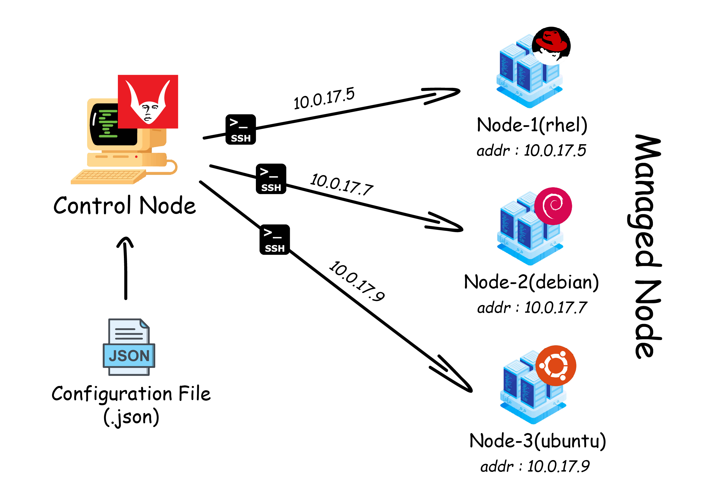

# What is VATOMETH?

<p align="center">
    </img>
</p>
 
 **_VATOMETH_** is a simple configuration management tool, It handles
configuration management, application deployment, cloud provisioning, and network automation.
 
 <hr>
 
 # VATOMETH Architecture

<p align="center">
    </img>
</p>
 
 <hr>
 
 # USAGE
 
## Requirement's install

```
pip3 install -r requirements.txt
```
 
 ## how to use

```
python3 vatometh.py -s --file config.json
python3 vatometh.py --crowded -f config.json


usage => python vatometh.py [ TYPE ] [ FILE ] [ FILENAME ]
--------------------------------------------------------
[ TYPE ] +==> [ -c | --crowded ] | [ -s | --single ]
[ FILE ] +==> [ -f | --file ]
[ FILENAME ] +==> [ whatever ].json
```

 ## Configuration
 
 ### Single Command configuration for single VM

```
{
    "service" : {

        "host"     :  "192.168.137.1",
        "port"     :   22,
        "user"     :  "qywok",
        "password" :  "qywok"

    },

    "commands" : {

        "message" : "[ installing docker ]",
        "cmd"     : "apt install docker.io"

    }
}
 
```

 ### Multi command configuration for single VM

```
{
    "service" : {

        "host"     :  "192.168.137.1",
        "port"     :   22,
        "user"     :  "qywok",
        "password" :  "qywok"

    },

    "commands" : [

        {

            "message" : "[ updating ]",
            "cmd"     : "apt update"

        },

        {

            "message" : "[ installing docker ]",
            "cmd"     : [

                "ls",
                "ls /",
                "apt install docker.io"

            ]

        }

    ]
}
 
```

 ### Multi and single command configuration for multi VM

```
{
    "services" : [

        {

            "host"     :  "192.168.43.177",
            "port"     :   22,
            "user"     :  "qywok",
            "password" :  "qywok",
            "commands" :  [

                {

                    "message" : "installing ssh & docker",
                    "cmd"     : [
        
                        "apt-get install openssh",
                        "apt-get install docker.io",
                        "service docker start"
        
                    ]
        
                }


            ]

        },
        
        {

            "host"     :  "192.168.137.9",
            "port"     :   22,
            "user"     :  "qywok",
            "password" :  "qywok",
            "commands" :  {

                "message" : "installing ssh & docker",
                "cmd"     : "apt-get install openssh"
    
            }

        },

        {

            "host"     :  "192.168.137.70",
            "port"     :   22,
            "user"     :  "qywok",
            "password" :  "qywok",
            "commands" :  [

                {

                    "message" : "installing ssh & docker",
                    "cmd"     : "apt-get install openssh"
    
                }

            ]

        }
        

    ]
}
 
```
